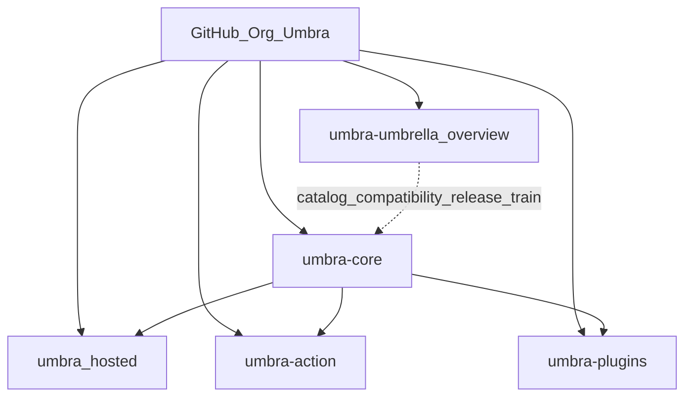

# Umbra

> **Copyright (c) 2026 Binay Dalai. All rights reserved.**
> This repository is strictly for viewing and contributing to the original project. You may not use, copy, modify, distribute, or commercialize this code for your own personal or commercial projects without explicit written permission. Only the original author retains the right to use and monetize this project.

**The umbrella overview for the Umbra platform — a change-control plane for coding agents.**

[-brightgreen.svg)](https://github.com/bkd-dotcom/umbra-umbrella/issues/10)

[umbra.engineer](https://umbra.engineer) · [Architecture](ARCHITECTURE.md) · [Integrations](INTEGRATIONS.md) · [Compatibility](COMPATIBILITY.md) · [Install](INSTALL.md)

---

Coding agents can now change your repository. **Umbra is the layer that decides how
much authority a given change has earned — and proves it.** Any executor (Claude
Code, Codex, Cursor, Copilot, a human) may *propose* a change; only Umbra may
*admit* authority and seal a signed receipt.

This repository is the **front door**: the single overview humans and agents open
first. It owns no governance code — that lives in [`umbra-core`](https://github.com/bkd-dotcom/umbra-core),
the one kernel every surface depends on. This repo is the map of the city.

## Mental model

| Layer | What it is |
|---|---|
| **`umbra-umbrella`** (this repo) | The overview: architecture, integration catalog, compatibility matrix, release train, install map. |
| **`umbra-core`** | The kernel — the *only* place governance logic lives (policy, guard, admit, dual verifier, plan binding, gates, passport, receipt, extension admission, CLI, MCP server). Also ships the **layered SAST detection engine** (`umbra scan`, 7 languages, cross-file taint, SARIF) and **governed fix fusion** (`umbra scan --fix` → admission → signed receipt). |
| **Each integration repo** | A district — its own release, CI, and Marketplace/plugin review; depends on pinned `umbra-core`. |
| **Admission Decision Pack** | The same passport stamp used in every district. |

## The one guarantee

Every admit run — from the CLI, the GitHub Action, the API, an MCP tool, or the
hosted console — returns one **Admission Decision Pack**: a verdict
(`admit`/`cap`/`block`), the earned authority level (`L0 observe` / `L1 analyze` /
`L2 branch-PR`), machine-readable reasons, the contract / trust-boundary / checks /
verifier reports, the exact proposed diff, and an **Ed25519-signed receipt** an
auditor can verify offline. `auto_merge` is always false — a human merges.

See [ARCHITECTURE.md](ARCHITECTURE.md) for the full design (the source of truth).

## Detect & fix, then govern

`umbra-core` also **finds vulnerabilities** and can **govern the fix**. `umbra scan`
is a deterministic, offline SAST engine across **7 languages** (Python, JavaScript,
Go, Java, Ruby, PHP, C#) with cross-file taint and SARIF output; `umbra scan --fix`
turns a finding into a bounded remediation an agent drafts under the admission
pipeline, sealed in a signed receipt — **branch-only, never merged**,
bring-your-own-key.

On a public 52-case, 7-language head-to-head ([umbra-eval](https://github.com/bkd-dotcom/umbra-eval)),
umbra-core reaches **100% recall at 0 false positives** — matching/leading a top LLM
scanner (Claude Opus 4.8 at 90%) while staying deterministic, offline, and free.
Detection is table stakes; the governance above is what the scanners don't attempt.

## Contributing — source-available, PRs welcome

Umbra is **source-available**: the code is public to read, run for evaluation, and
**contribute to** — but it is **not open source**. It is **All Rights Reserved
(© 2026 Binay Dalai)**, and contributions are accepted under a
**Contributor License Agreement**. In plain terms:

- ✅ **You can** contribute, and you'll be **credited** (in `CONTRIBUTORS.md`, the Git
  history, and release notes). You may truthfully say you contributed.
- ❌ **You cannot** use, sell, sublicense, or commercialize the project, or present it
  (in whole or part) as your own work or brand.
- The **owner alone** retains the right to use and monetize the project.

Contributing is easy and welcome:

- 🌱 **Good first issues (tracking board):**
  [bkd-dotcom/umbra-umbrella#10](https://github.com/bkd-dotcom/umbra-umbrella/issues/10)
  — well-scoped tasks with exact files + acceptance criteria.
- 💬 **Questions / ideas:** [Discussions](https://github.com/bkd-dotcom/umbra-umbrella/discussions)
- 📝 **How to contribute + sign the CLA:** each repo's `CONTRIBUTING.md` and `CLA.md`
  (e.g. [umbra-core](https://github.com/bkd-dotcom/umbra-core/blob/main/CONTRIBUTING.md)).
  The best first PR is **adding a detection test case** in
  [umbra-eval](https://github.com/bkd-dotcom/umbra-eval).

The strongest contribution targets are **umbra-core** (the engine), **umbra-eval**
(the benchmark), and **umbra-reviewer** — each has tests + CI to validate your PR.

## Start here

- **New to Umbra?** → [ARCHITECTURE.md](ARCHITECTURE.md)
- **Want to install it in a day?** → [INSTALL.md](INSTALL.md)
- **Which repo do I want?** → [INTEGRATIONS.md](INTEGRATIONS.md)
- **Which versions work together?** → [COMPATIBILITY.md](COMPATIBILITY.md)
- **How do releases flow?** → [RELEASE.md](RELEASE.md)
- **Want to contribute?** → [good first issues](https://github.com/bkd-dotcom/umbra-umbrella/issues/10) · [Discussions](https://github.com/bkd-dotcom/umbra-umbrella/discussions)
- **Announcing / sharing Umbra?** → [LAUNCH.md](LAUNCH.md)

## License

**Copyright (c) 2026 Binay Dalai. All rights reserved.** This code is not open source. You may not use, copy, modify, distribute, or commercialize it for your own personal or commercial purposes without explicit written permission from the author, who alone retains the right to use and monetize this project. See [CONTRIBUTING.md](CONTRIBUTING.md).
