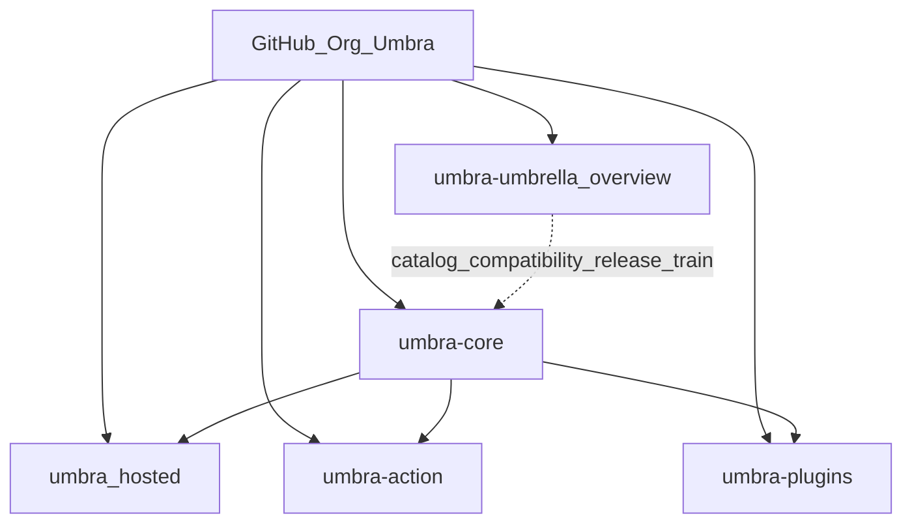

# Umbra

**The umbrella overview for the Umbra platform — a change-control plane for coding agents.**

[umbra.engineer](https://umbra.engineer) · [Architecture](ARCHITECTURE.md) · [Integrations](INTEGRATIONS.md) · [Compatibility](COMPATIBILITY.md) · [Install](INSTALL.md)

---

Coding agents can now change your repository. **Umbra is the layer that decides how
much authority a given change has earned — and proves it.** Any executor (Claude
Code, Codex, Cursor, Copilot, a human) may *propose* a change; only Umbra may
*admit* authority and seal a signed receipt.

This repository is the **front door**: the single overview humans and agents open
first. It owns no governance code — that lives in [`umbra-core`](https://github.com/bkd-dotcom/umbra-core),
the one kernel every surface depends on. This repo is the map of the city.

## Mental model

| Layer | What it is |
|---|---|
| **`umbra-umbrella`** (this repo) | The overview: architecture, integration catalog, compatibility matrix, release train, install map. |
| **`umbra-core`** | The kernel — the *only* place governance logic lives (policy, guard, admit, dual verifier, plan binding, gates, passport, receipt, extension admission, CLI, MCP server). |
| **Each integration repo** | A district — its own release, CI, and Marketplace/plugin review; depends on pinned `umbra-core`. |
| **Admission Decision Pack** | The same passport stamp used in every district. |

## The one guarantee

Every admit run — from the CLI, the GitHub Action, the API, an MCP tool, or the
hosted console — returns one **Admission Decision Pack**: a verdict
(`admit`/`cap`/`block`), the earned authority level (`L0 observe` / `L1 analyze` /
`L2 branch-PR`), machine-readable reasons, the contract / trust-boundary / checks /
verifier reports, the exact proposed diff, and an **Ed25519-signed receipt** an
auditor can verify offline. `auto_merge` is always false — a human merges.

See [ARCHITECTURE.md](ARCHITECTURE.md) for the full design (the source of truth).

## Start here

- **New to Umbra?** → [ARCHITECTURE.md](ARCHITECTURE.md)
- **Want to install it in a day?** → [INSTALL.md](INSTALL.md)
- **Which repo do I want?** → [INTEGRATIONS.md](INTEGRATIONS.md)
- **Which versions work together?** → [COMPATIBILITY.md](COMPATIBILITY.md)
- **How do releases flow?** → [RELEASE.md](RELEASE.md)

## License

[MIT](LICENSE) © 2026 Binay Dalai.
